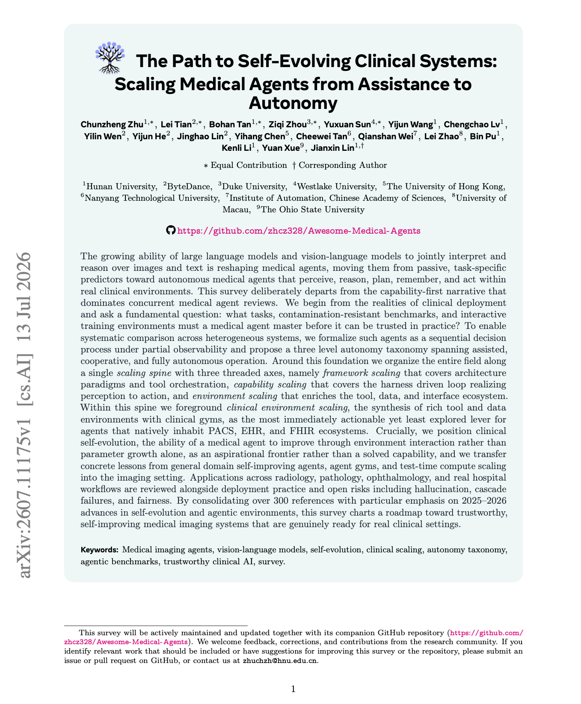
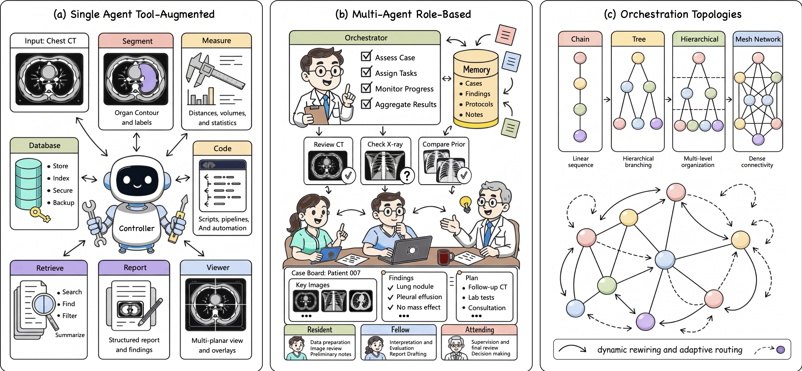
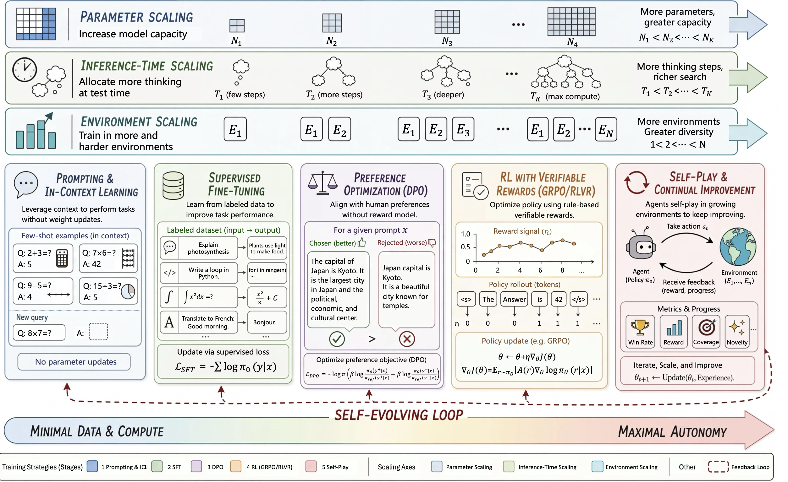
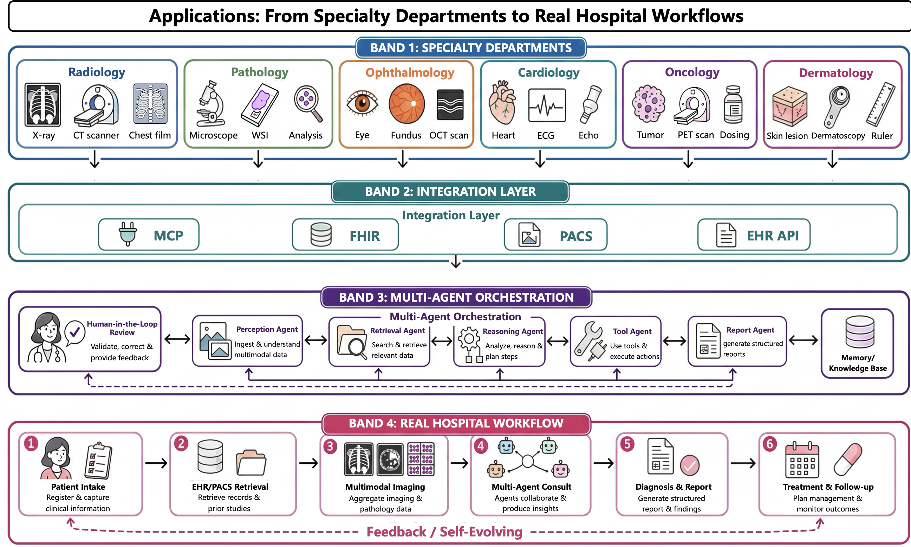
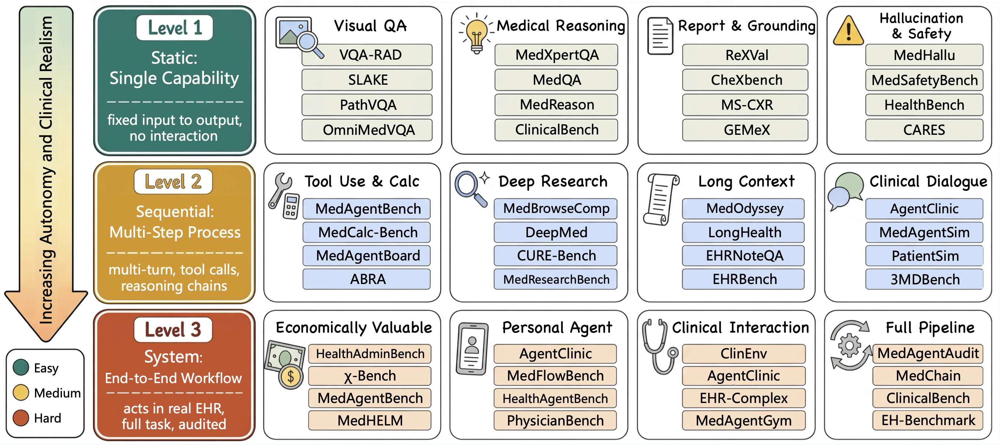

<h1 align="center">Awesome-Medical-Agents</h1>

<p align="center">
  <a href="https://arxiv.org/pdf/2607.11175v1"></a>
  <a href="https://github.com/sindresorhus/awesome"></a>
  <a href="https://GitHub.com/Naereen/StrapDown.js/graphs/commit-activity"></a>
  <a href="http://makeapullrequest.com"></a>
</p>

<p align="center">
  A curated reading list on <b>medical agents: scaling clinical systems from assistance to autonomy</b>.
  <br>
  Medical agents integrate perception, reasoning, planning, memory, tool use, and self-reflection into trustworthy clinical workflows.
</p>

<p align="center">
  
</p>

---

<p align="center">
  <a href="#what-are-medical-agents">What are Medical Agents?</a> ·
  <a href="#why-agents-matter-now">Why Agents Matter Now?</a> ·
  <a href="#repository-map">Repository Map</a> ·
  <a href="#table-of-contents">Table of Contents</a>
</p>

Papers with publicly released code or project resources include an inline `[[Code](...)]` link. Entries without verified repositories omit that link. All arXiv IDs and repository URLs in this list have been verified to resolve to the correct paper or code.

> Contributions are welcome. If you find missing papers, inaccurate classifications, or newly released code, feel free to update this list.

## What are Medical Agents?

In the context of clinical AI, a **medical agent** is a computational system that moves beyond static, single-pass inference to interact dynamically with clinical environments. Unlike traditional foundation models that map inputs to outputs, agents actively decompose complex clinical tasks, invoke specialized tools, maintain contextual memory, and iteratively refine their decisions based on intermediate feedback.

A medical agent is formally defined as $\mathcal{A} = (\mathcal{P}, \mathcal{R}, \mathcal{L}, \mathcal{M}, \mathcal{T}, \mathcal{F})$, composed of six functional modules:

| Module | Function | Clinical Role |
|---|---|---|
| **Perception** $\mathcal{P}$ | Visual feature extraction from medical images | Sensory interface to raw clinical data |
| **Reasoning** $\mathcal{R}$ | Structured clinical thinking (CoT, differential diagnosis) | Diagnostic accuracy and explainability |
| **Planning** $\mathcal{L}$ | Task decomposition into executable sub-tasks | Efficient multistep workflow execution |
| **Memory** $\mathcal{M}$ | Short-term + long-term information storage and retrieval | Contextual continuity across encounters |
| **Tool Use** $\mathcal{T}$ | Invocation of external specialist models and databases | Extended capabilities beyond intrinsic knowledge |
| **Action Reflection** $\mathcal{F}$ | Self-evaluation and iterative improvement | Error correction and quality assurance |

## Why Agents Matter Now

This repository follows the survey **The Path to Self-Evolving Clinical Systems: Scaling Medical Agents from Assistance to Autonomy**. Its organizing principle is deployment-first: before an agent can be trusted in practice, it must handle real clinical scenarios, contamination-resistant benchmarks, and interactive training environments.

The transition from passive models to autonomous agents is driven by four converging factors:

| Factor | Why it matters |
|---|---|
| **Multimodal LLM maturation** | GPT-4V, Med-Gemini, LLaVA-Med provide powerful reasoning backbones that jointly process images and text |
| **Standardized tool interfaces** | MCP and function-calling APIs enable seamless orchestration of diverse specialist models |
| **Environment scaling** | Agent capability can be amplified by enriching the tool environment, complementing parameter scaling |
| **Clinical workflow demand** | Real consultations require multistep reasoning (read scan → cross-reference → report → flag follow-up) |

```text
🏥 Clinical Need → 🧠 Agent Reasoning → 🔧 Tool Orchestration → 📋 Report & Action → 🔁 Self-Reflection
```

## Three-Level Autonomy Taxonomy

| Level | Name | Description | Representative |
|---|---|---|---|
| **L1** | Assisted | Agent enhances clinician efficiency; all decisions require confirmation | CheXagent, MedSAM |
| **L2** | Cooperative | Agent proactively decomposes tasks within human-in-the-loop framework | MDAgents, MedAgent-Pro |
| **L3** | Fully Autonomous | End-to-end workflows with minimal oversight and exception-based escalation | RadAgent, Agent Hospital |

## Scaling Spine

Following the survey, we organize the field around a single **scaling spine**:

| Axis | Focus | Why it matters |
|---|---|---|
| **Framework Scaling** | Architecture paradigms, tool orchestration, and multi-agent topologies | Determines how agents coordinate reasoning and action |
| **Capability Scaling** | The harness-driven loop from perception to action | Turns isolated modules into closed clinical workflows |
| **Environment Scaling** | Rich tool, data, PACS, EHR, FHIR, and clinical gym ecosystems | Expands what agents can do without relying only on larger models |

The long-term destination is **clinical self-evolution**: agents that improve through interaction with environments, consolidate successful workflows, and adapt to new clinical distributions under rigorous governance.

## Survey Scope and Methodology

| Item | Scope |
|---|---|
| **Time window** | January 2022 to June 2026, covering the period in which LLM-driven agency became technically feasible for medical imaging and clinical workflows |
| **Search axes** | Agentic AI (`agent`, `agentic`, `tool use`, `multi-agent`, `autonomous`), medical imaging (`radiology`, `pathology`, `CT`, `MRI`, `X-ray`, `report generation`), and foundation models (`LLM`, `VLM`, `vision-language`) |
| **Screening scale** | 1,174 initial records, 942 after de-duplication, and 300+ included studies after reviewer screening and snowballing |
| **Inclusion criterion** | Systems with an autonomous loop that can perceive, reason, and act on an imaging or clinical task |
| **Scope boundary** | EHR and therapeutic agents are included when they provide reusable architectural lessons for imaging agents, such as tool use, code execution, memory, safety, or downstream care handoff |

## Paradigm Shift: Foundation Models → Agent Systems

| Characteristic | Foundation Models | Agent Systems |
|---|---|---|
| Task scope | Multitask, transferable | Multistep workflows |
| Reasoning | Implicit (in weights) | Explicit (CoT, tree search) |
| Tool integration | Limited (end-to-end) | Native (MCP, function calls) |
| Interaction | One-shot or few-shot | Multi-turn, iterative |
| Self-improvement | Limited | Reflection, self-play |
| Scaling axes | Parameter scaling | Parameter + inference-time + environment scaling |

## Repository Map

This repository is organized as a **conceptual map** of medical agent research. We group papers by their role in the agent pipeline.

| Section | Role in the repository |
|---|---|
| **Core Capabilities** | Six functional modules: perception, reasoning, planning, memory, tool use, and reflection |
| **Architecture Paradigms** | Single-agent, multi-agent, code-generation, and hybrid designs |
| **Training Strategies** | Prompting, SFT, preference optimization, RLVR/GRPO, self-play, and scaling |
| **Clinical Applications** | Radiology, pathology, ophthalmology, oncology, neurology, and crossmodal |
| **Benchmarks & Evaluation** | Static, sequential, and system-level evaluation frameworks |
| **Deployment & Governance** | Clinical integration, interoperability standards, and regulatory pathways |

Overall, this structure follows the lifecycle of a medical agent:

**Perceive → Reason → Plan → Remember → Use Tools → Reflect → Deploy**


## Table of Contents

<details open>
<summary>Browse the reading list</summary>

- [Core Capability Modules](#core-capability-modules)
- [Architecture Paradigms](#architecture-paradigms)
- [Training Strategies and Scaling](#training-strategies-and-scaling)
- [Clinical Applications](#clinical-applications)
- [Benchmarks and Evaluation](#benchmarks-and-evaluation)
  - [Agent-Specific Benchmarks](#agent-specific-benchmarks)
  - [Evaluation Metrics Beyond Accuracy](#evaluation-metrics-beyond-accuracy)
- [Deployment and Governance](#deployment-and-governance)
- [Open Challenges and Future Directions](#open-challenges-and-future-directions)

</details>

---

## Core Capability Modules

| Module | Year | Venue | Title / Method | Paper | Code / Data | Tags |
|---|---:|---|---|---|---|---|
| Backbone / Foundation | 2025 | arXiv | MedGemma: Open Medical Foundation Models | [Paper](https://arxiv.org/abs/2507.05201) | - | Medical MLLM |
| Backbone / Foundation | 2025 | arXiv | Lingshu: A Generalist Foundation Model for Unified Multimodal Medical Understanding and Reasoning | [Paper](https://arxiv.org/abs/2506.07044) | - | Generalist medical MLLM |
| Backbone / Foundation | 2025 | arXiv | HealthGPT: A Medical Large Vision-Language Model | [Paper](https://arxiv.org/abs/2502.09838) | - | Medical VLM |
| Backbone / Foundation | 2025 | arXiv | InternVL3: Exploring Advanced Training and Test-Time Recipes for Open-Source Multimodal Models | [Paper](https://arxiv.org/abs/2504.10479) | [Code](https://github.com/OpenGVLab/InternVL) | Open MLLM |
| Backbone / Foundation | 2025 | arXiv | Qwen3-VL: Multimodal Foundation Model for Visual Reasoning | [Paper](https://arxiv.org/abs/2511.21631) | [Code](https://github.com/QwenLM/Qwen3-VL) | Open MLLM |
| Perception | 2023 | NeurIPS | LLaVA-Med: Training a Large Language-and-Vision Assistant for Biomedicine | [Paper](https://arxiv.org/abs/2306.00890) | [Code](https://github.com/microsoft/LLaVA-Med) | Medical VLM, VQA |
| Perception | 2023 | arXiv | BiomedCLIP: Biomedical Contrastive Vision-Language Pretraining on 15M Pairs | [Paper](https://arxiv.org/abs/2303.00915) | [Model](https://huggingface.co/microsoft/BiomedCLIP-PubMedBERT_256-vit_base_patch16_224) | Contrastive pretraining |
| Perception | 2024 | arXiv | RAD-DINO: Scalable Medical Image Encoders Beyond Text Supervision | [Paper](https://arxiv.org/abs/2401.10815) | [Model](https://huggingface.co/microsoft/rad-dino) | Radiology encoder |
| Perception | 2024 | Nature Medicine | CONCH: A Visual-Language Foundation Model for Computational Pathology | [Paper](https://arxiv.org/abs/2307.12914) | [Code](https://github.com/mahmoodlab/CONCH) | Pathology VLM |
| Perception | 2024 | CVPR | InternVL: Scaling Vision Foundation Models | [Paper](https://arxiv.org/abs/2312.14238) | [Code](https://github.com/OpenGVLab/InternVL) | Vision foundation |
| Perception | 2024 | arXiv | CheXagent: Towards a Foundation Model for Chest X-Ray Interpretation | [Paper](https://arxiv.org/abs/2401.12208) | [Code](https://github.com/Stanford-AIMI/CheXagent) | CXR, report understanding |
| Perception | 2024 | Nature Methods | MedSAM: Segment Anything in Medical Images | [Paper](https://www.nature.com/articles/s41592-024-02260-z) | [Code](https://github.com/bowang-lab/MedSAM) | Segmentation, grounding |
| Perception | 2025 | NeurIPS | BTB3D: Better Tokens for Better 3D Vision-Language Modeling in Medical Imaging | [Paper](https://arxiv.org/abs/2510.20639) | [Code](https://github.com/ibrahimethemhamamci/BTB3D) | 3D tokenization |
| Perception | 2025 | arXiv | RadVLM: Multitask Conversational Vision-Language Model for Radiology | [Paper](https://arxiv.org/abs/2502.03333) | [Code](https://github.com/uzh-dqbm-cmi/RadVLM) | Radiology VLM |
| Perception | 2025 | arXiv | MedRAX: Medical Reasoning Agent for Chest X-ray | [Paper](https://arxiv.org/abs/2502.02673) | [Code](https://github.com/bowang-lab/MedRAX) | Tool use, CXR |
| Perception / Attention | 2026 | AAAI | MedEyes: Learning Dynamic Visual Focus for Medical Progressive Diagnosis | - | - | Progressive focus |
| Reasoning | 2024 | NeurIPS | MDAgents: An Adaptive Collaboration of LLMs for Medical Decision-Making | [Paper](https://arxiv.org/abs/2404.15155) | [Code](https://github.com/mitmedialab/MDAgents) | Multi-agent, diagnosis |
| Reasoning | 2024 | arXiv | MedAgents: Large Language Models as Collaborators for Zero-shot Medical Reasoning | [Paper](https://arxiv.org/abs/2311.10537) | [Code](https://github.com/gersteinlab/MedAgents) | Multi-agent, reasoning |
| Reasoning | 2024 | arXiv | Med-Gemini: Capabilities of Gemini Models in Medicine | [Paper](https://arxiv.org/abs/2404.18416) | - | Medical reasoning |
| Reasoning | 2025 | arXiv | MEDDxAgent: Unified Framework for Explainable Differential Diagnosis | [Paper](https://arxiv.org/abs/2502.19175) | [Code](https://github.com/nec-research/meddxagent) | Differential diagnosis |
| Reasoning | 2025 | arXiv | MACD: Multi-Agent Clinical Diagnosis with Self-Learned Knowledge for LLMs | [Paper](https://arxiv.org/abs/2509.20067) | [Code](https://github.com/qjdzj/MACD-Multi-Agent-Clinical-Diagnosis-with-Self-Learned-Knowledge-for-LLM) | Knowledge, diagnosis |
| Reasoning | 2025 | arXiv | MedReason: Medical Reasoning with Knowledge Graph Grounding | [Paper](https://arxiv.org/abs/2504.00993) | [Code](https://github.com/UCSC-VLAA/MedReason) | KG, reasoning chains |
| Reasoning | 2025 | arXiv | MedVLM-R1: Incentivizing Medical Reasoning via Reinforcement Learning | [Paper](https://arxiv.org/abs/2502.19634) | [Code](https://github.com/JZPeterPan/MedVLM-R1) | RLVR, reasoning |
| Reasoning | 2026 | arXiv | CARE: Evidence-Grounded Agentic Reasoning for Medical VQA | [Paper](https://arxiv.org/abs/2603.01607) | - | Evidence grounding |
| Reasoning / Causality | 2026 | arXiv | MedCausalX: Adaptive Causal Reasoning with Self-Reflection for Trustworthy Medical VLMs | [Paper](https://arxiv.org/abs/2603.23085) | - | Causal reasoning |
| Reasoning / RAG | 2026 | arXiv | SEMA-RAG: Self-Evolving Multi-Agent Retrieval-Augmented Generation for Medical Reasoning | [Paper](https://arxiv.org/abs/2605.17101) | - | RAG, self-evolving |
| Reasoning / RAG | 2026 | arXiv | From Conflict to Consensus: Boosting Medical Reasoning via Multi-Round Agentic RAG | [Paper](https://arxiv.org/abs/2603.03292) | [Code](https://github.com/NJU-RL/MA-RAG) | Multi-round RAG |
| Reasoning / Debate | 2026 | ACL | Dialectic-Med: Mitigating Diagnostic Hallucinations via Counterfactual Adversarial Multi-Agent Debate | [Paper](https://arxiv.org/abs/2604.11258) | - | Debate, hallucination |
| Planning | 2025 | arXiv | MedAgent-Pro: Evidence-based Multi-modal Medical Diagnosis via Multi-agent Collaboration | [Paper](https://arxiv.org/abs/2503.18968) | [Code](https://github.com/jinlab-imvr/MedAgent-Pro) | Planning, evidence |
| Planning | 2025 | arXiv | MDTeamGPT: Self-evolving Multi-agent Framework for MDT Medical Consultation | [Paper](https://arxiv.org/abs/2503.13856) | - | MDT, consultation |
| Planning | 2026 | arXiv | MedOpenClaw: Auditable VLM Agent for 3D Slicer Clinical Operations | [Paper](https://arxiv.org/abs/2603.24649) | - | Executable clinical tools |
| Planning | 2026 | arXiv | MACRO: Experience-Driven Self-Skill Discovery for Medical Imaging Agents | [Paper](https://arxiv.org/abs/2603.05860) | - | Tool discovery |
| Planning / Examination | 2026 | arXiv | MedExAgent: Training LLM Agents to Ask, Examine, and Diagnose in Noisy Clinical Environments | [Paper](https://arxiv.org/abs/2605.07058) | - | Ask-examine-diagnose |
| Memory | 2025 | NeurIPS | A-MEM: Agentic Memory for LLM Agents | [Paper](https://arxiv.org/abs/2502.12110) | [Code](https://github.com/agiresearch/A-mem) | Agentic memory |
| Memory | 2024 | EMNLP | RULE: Reliable Multimodal RAG for Factuality in Medical VLMs | [Paper](https://arxiv.org/abs/2407.05131) | [Code](https://github.com/richard-peng-xia/RULE) | RAG, factuality |
| Memory | 2026 | arXiv | ClinicalAgents: Clinical Trial Multi-Agent System with Longitudinal Memory | [Paper](https://arxiv.org/abs/2601.01170) | - | Memory, clinical trials |
| Memory / Safety | 2026 | arXiv | Detecting Clinical Discrepancies in Health Coaching Agents with Dual-Stream Memory | [Paper](https://arxiv.org/abs/2604.27045) | - | Memory reconciliation |
| Tool Use | 2023 | ICLR 2024 | ToolLLM: Mastering 16,000+ Real-World APIs | [Paper](https://arxiv.org/abs/2307.16789) | [Code](https://github.com/OpenBMB/ToolBench) | Tool learning |
| Tool Use | 2024 | EMNLP | EHRAgent: Code-empowered Tabular Reasoning on EHRs | [Paper](https://arxiv.org/abs/2401.07128) | [Code](https://github.com/wshi83/EhrAgent) | EHR, code-as-action |
| Tool Use / Reflection | 2025 | ACL | ReflecTool: Reflection-Aware Tool-Augmented Clinical Agents | [Paper](https://arxiv.org/abs/2410.17657) | [Code](https://github.com/BlueZeros/ReflecTool) | Reflection, tools |
| Tool Use | 2026 | arXiv | ABRA: Agentic Benchmark for Radiology Assistant | [Paper](https://arxiv.org/abs/2605.11224) | [Code](https://github.com/Luab/ABRA) | OHIF, Orthanc, tools |
| Tool Use / FHIR | 2026 | arXiv | Reinforcement Learning for Tool-Calling Agents in Fast Healthcare Interoperability Resources | [Paper](https://arxiv.org/abs/2605.14126) | - | FHIR, tool calling |
| Tool Use / FHIR | 2026 | arXiv | Empowering Locally Deployable Medical Agent via State Enhanced Logical Skills for FHIR-based Clinical Tasks | [Paper](https://arxiv.org/abs/2603.06902) | - | FHIR, local deployment |
| Environment Scaling | 2026 | arXiv | EnvScaler: Scaling Tool-Interactive Environments for Agents | [Paper](https://arxiv.org/abs/2601.05808) | [Code](https://github.com/RUC-NLPIR/EnvScaler) | Tool environment, scaling |
| Reflection / Audit | 2025 | arXiv | MedAgentAudit: Auditing Collaborative Failure Modes in Medical Multi-Agent Systems | [Paper](https://arxiv.org/abs/2510.10185) | [Code](https://github.com/MedX-PKU/MedAgentAudit) | Safety, audit |
| Reflection / Guardrails | 2026 | arXiv | CareGuardAI: Context-Aware Multi-Agent Guardrails for Clinical Safety and Hallucination Mitigation | [Paper](https://arxiv.org/abs/2604.26959) | - | Guardrails, safety |
| Reflection / Verification | 2026 | arXiv | CuraView: Multi-Agent Hallucination Detection with GraphRAG-Enhanced Knowledge Verification | [Paper](https://arxiv.org/abs/2605.03476) | - | Hallucination detection |
| Self-Improvement | 2026 | arXiv | Evo-MedAgent: Evolutionary Agent Self-Improvement | [Paper](https://arxiv.org/abs/2604.14475) | - | Evolution, self-improvement |

## Architecture Paradigms

| Family | Year | Venue | Title / Method | Paper | Code / Data | Tags |
|---|---:|---|---|---|---|---|
| Single-agent tool-augmented | 2024 | arXiv | CheXagent: Foundation Model for Chest X-Ray Interpretation | [Paper](https://arxiv.org/abs/2401.12208) | [Code](https://github.com/Stanford-AIMI/CheXagent) | Single agent, CXR |
| Single-agent tool-augmented | 2025 | arXiv | MedRAX: Medical Reasoning Agent for Chest X-ray | [Paper](https://arxiv.org/abs/2502.02673) | [Code](https://github.com/bowang-lab/MedRAX) | Tools, reporting |
| Single-agent tool-augmented | 2024 | arXiv | MMedAgent: Learning to Use Medical Tools | [Paper](https://arxiv.org/abs/2407.02483) | - | Tool routing |
| Code-as-action | 2024 | EMNLP | EHRAgent: Code-empowered EHR Reasoning | [Paper](https://arxiv.org/abs/2401.07128) | [Code](https://github.com/wshi83/EhrAgent) | EHR, code execution |
| Code-as-action | 2026 | arXiv | MedOpenCLAW / MedFlowBench: Auditing Medical Imaging Workflow Agents | [Paper](https://arxiv.org/abs/2603.24649) | - | 3D Slicer, QuPath |
| Code-as-action | 2026 | arXiv | FastOMOP: Reliable Agentic Real-World Evidence Generation on OMOP CDM Data | [Paper](https://arxiv.org/abs/2604.24572) | - | OMOP, RWE |
| Role-based multi-agent | 2024 | NeurIPS | MDAgents: Adaptive Collaboration of LLMs for Medical Decision-Making | [Paper](https://arxiv.org/abs/2404.15155) | [Code](https://github.com/mitmedialab/MDAgents) | Multi-agent, panel |
| Role-based multi-agent | 2024 | arXiv | MedAgents: LLM Collaborators for Medical Reasoning | [Paper](https://arxiv.org/abs/2311.10537) | [Code](https://github.com/gersteinlab/MedAgents) | Role play, debate |
| Role-based multi-agent | 2025 | arXiv | MDTeamGPT: Multi-disciplinary Team Medical Consultation | [Paper](https://arxiv.org/abs/2503.13856) | - | MDT, consultation |
| Role-based multi-agent | 2026 | arXiv | Meissa: Multi-modal Medical Agentic Intelligence | [Paper](https://arxiv.org/abs/2603.09018) | [Code](https://github.com/Schuture/Meissa) | Multimodal, generalist |
| Role-based multi-agent | 2026 | arXiv | XrayClaw: Cooperative-Competitive Multi-Agent Alignment for Trustworthy Chest X-ray Diagnosis | [Paper](https://arxiv.org/abs/2604.02695) | - | CXR, alignment |
| Dynamic topology | 2024 | ICML | GPTSwarm: Language Agents as Optimizable Graphs | [Paper](https://arxiv.org/abs/2402.16823) | [Code](https://github.com/metauto-ai/GPTSwarm) | Topology search |
| Dynamic topology | 2023 | arXiv | DyLAN: Dynamic LLM-Agent Network | [Paper](https://arxiv.org/abs/2310.02170) | - | Agent selection |
| Self-evolving architecture | 2026 | arXiv | Evo-MedAgent: Evolutionary Agent Self-Improvement | [Paper](https://arxiv.org/abs/2604.14475) | - | Self-improvement |
| Research co-agent | 2026 | arXiv | VERITAS: Multi-Agent Co-Scientist for Verifiable Image-Derived Hypothesis Testing | [Paper](https://arxiv.org/abs/2604.12144) | [Code](https://github.com/LucZot/veritas) | Co-scientist, imaging |

<p align="center">
  
</p>

---

## Training Strategies and Scaling

<p align="center">
  
</p>

| Strategy | Year | Venue | Title / Method | Paper | Code / Data | Tags |
|---|---:|---|---|---|---|---|
| Prompting / ICL | 2026 | arXiv | Agentic LLMs for Training-Free Neuro-Radiological Image Analysis | [Paper](https://arxiv.org/abs/2604.16729) | - | Zero-shot, neuro-radiology |
| Prompting / Self-evolution | 2024 | arXiv | Agent Hospital / MedAgent-Zero: Self-Evolution without Manual Labeling | [Paper](https://arxiv.org/abs/2405.02957) | - | Simulation, self-evolving |
| Supervised Fine-Tuning | 2025 | arXiv | RadVLM: Multitask Conversational Fine-Tuning for Radiology | [Paper](https://arxiv.org/abs/2502.03333) | [Code](https://github.com/uzh-dqbm-cmi/RadVLM) | Radiology, SFT |
| Supervised Fine-Tuning | 2024 | arXiv | CheXagent: Clinical Knowledge Alignment, Finding Extraction, Report Generation | [Paper](https://arxiv.org/abs/2401.12208) | [Code](https://github.com/Stanford-AIMI/CheXagent) | CXR, SFT |
| Preference Optimization | 2025 | CVPR | OPA-DPO: On-Policy Alignment for Mitigating Hallucination in LVLMs | [Paper](https://arxiv.org/abs/2501.09695) | [Code](https://github.com/zhyang2226/OPA-DPO) | DPO, hallucination |
| RL / Verifiable Reward | 2026 | arXiv | MedGRPO: Group Relative Policy Optimization for Medical Video Understanding | [Paper](https://arxiv.org/abs/2512.06581) | - | GRPO, video |
| RL / Verifiable Reward | 2025 | arXiv | MedVLM-R1: Incentivizing Medical Reasoning via Reinforcement Learning | [Paper](https://arxiv.org/abs/2502.19634) | [Code](https://github.com/JZPeterPan/MedVLM-R1) | RLVR, reasoning |
| RL / Verifiable Reward | 2025 | Nature | DeepSeek-R1: Incentivizing Reasoning in LLMs via Reinforcement Learning | [Paper](https://arxiv.org/abs/2501.12948) | [Code](https://github.com/deepseek-ai/DeepSeek-R1) | Foundation RL |
| Self-Play / Continual Improvement | 2026 | arXiv | Evo-MedAgent: Iterative Self-Improvement Beyond One-Shot Diagnosis | [Paper](https://arxiv.org/abs/2604.14475) | - | Evolution, self-play |
| Test-Time Scaling | 2024 | arXiv | Scaling LLM Test-Time Compute Optimally can be More Effective than Scaling Model Parameters | [Paper](https://arxiv.org/abs/2408.03314) | - | Inference scaling |
| Environment Scaling | 2026 | arXiv | EnvScaler: Systematic Expansion of Tool-Interactive Environments | [Paper](https://arxiv.org/abs/2601.05808) | [Code](https://github.com/RUC-NLPIR/EnvScaler) | Tool environment |
| Environment Scaling | 2025 | ICLR 2026 | MedAgentGym: Scalable Agentic Training Environment for Biomedical Data Science | [Paper](https://arxiv.org/abs/2506.04405) | [Code](https://github.com/wshi83/MedAgentGym) | Clinical gym |

---

## Clinical Applications

<p align="center">
  
</p>

| Area | Year | Venue | Title / Method | Paper | Code / Data | Tags |
|---|---:|---|---|---|---|---|
| Radiology | 2026 | arXiv | MedOpenClaw: Auditable VLM Agent for 3D Slicer | [Paper](https://arxiv.org/abs/2603.24649) | - | 3D Slicer, audit |
| Radiology | 2026 | ACL | MARCH: Multi-Agent Radiology Clinical Hierarchy for CT Report Generation | [Paper](https://arxiv.org/abs/2604.16175) | - | CT, report generation |
| Radiology | 2026 | arXiv | RadAgent: Autonomous Radiology Workflow Management | [Paper](https://arxiv.org/abs/2604.15231) | [Code](https://github.com/eth-medical-ai-lab/rad-agent) | Workflow, CT |
| Radiology / Neurology | 2026 | arXiv | Agentic LLMs for Training-Free Neuro-Radiological Image Analysis | [Paper](https://arxiv.org/abs/2604.16729) | - | Brain MRI, zero-shot |
| Radiology / Neurology | 2026 | arXiv | GAZE: Grounded Agentic Zero-shot Evaluation with Viewer-Level Tools on Rare Brain MRI | [Paper](https://arxiv.org/abs/2605.00876) | - | Brain MRI, viewer tools |
| Radiology / Oncology | 2026 | arXiv | DeepTumorVQA: Hierarchical 3D CT Benchmark for Tumor-Centric Visual Question Answering | [Paper](https://arxiv.org/abs/2605.09679) | - | 3D CT, tumor VQA |
| Radiology | 2026 | arXiv | XrayClaw: Cooperative-Competitive Multi-Agent Alignment for Trustworthy Chest X-ray Diagnosis | [Paper](https://arxiv.org/abs/2604.02695) | - | CXR, alignment |
| Radiology | 2025 | ICML | MedRAX: Tool Orchestration for Chest X-ray Analysis | [Paper](https://arxiv.org/abs/2502.02673) | [Code](https://github.com/bowang-lab/MedRAX) | CXR, tools |
| Radiology | 2025 | ICLR 2026 | MedAgent-Pro: Evidence-Based Multimodal Medical Diagnosis | [Paper](https://arxiv.org/abs/2503.18968) | [Code](https://github.com/jinlab-imvr/MedAgent-Pro) | Evidence, multimodal |
| Radiology | 2025 | arXiv | CXR-Agent: Automated Chest Radiograph Interpretation | [Paper](https://arxiv.org/abs/2510.21324) | [Code](https://github.com/laojiahuo2003/CXRAgent) | CXR, reporting |
| Radiology | 2025 | arXiv | RadFabric: Agentic AI System with Reasoning Capability for Radiology | [Paper](https://arxiv.org/abs/2506.14142) | [Project](https://yidong11.github.io/Towards-Multi-Modal-Agentic-AI-System-for-Chest-X-Ray/) | CXR, reasoning |
| Pathology | 2025 | arXiv | PathAgent: Navigator-Perceptor-Executor Loop for Whole-Slide Images | [Paper](https://arxiv.org/abs/2511.17052) | [Code](https://github.com/G14nTDo4/PathAgent) | WSI, navigation |
| Pathology | 2025 | ICCV | PathFinder: Interactive Multiagent Whole-Slide Image Search | [Paper](https://arxiv.org/abs/2502.08916) | - | WSI, multi-agent |
| Pathology | 2025 | MICCAI | WSI-Agents: Collaborative Multiagent WSI Analysis | [Paper](https://arxiv.org/abs/2507.14680) | [Code](https://github.com/CVI-SZU/WSI-Agents) | WSI, collaboration |
| Pathology | 2025 | arXiv | TissueLab: Agentic Tissue Analysis Environment | [Paper](https://arxiv.org/abs/2509.20279) | [Code](https://github.com/zhihuanglab/TissueLab-SDK) | Environment, tissue |
| Ultrasound | 2026 | arXiv | Echo-alpha: Large Agentic Multimodal Reasoning Model for Ultrasound Interpretation | [Paper](https://arxiv.org/abs/2604.28011) | - | Ultrasound, reasoning |
| Dermatology | 2026 | MICCAI | DermAgent: Self-Reflective Agentic System for Dermatological Image Analysis | [Paper](https://arxiv.org/abs/2605.14403) | - | Dermatology, tools |
| Dermatology | 2026 | arXiv | SkinGPT-X: Self-Evolving Collaborative Multi-Agent System for Dermatological Diagnosis | [Paper](https://arxiv.org/pdf/2603.26122) | - | Dermatology, self-evolving |
| Ophthalmology | 2025 | arXiv | EyeAgent: Tool-Orchestrated Ophthalmic Agent across Imaging Modalities | [Paper](https://arxiv.org/abs/2511.09394) | - | 53 tools, 23 modalities |
| Ophthalmology | 2025 | arXiv | EyecareGPT: Multimodal LLM for Ophthalmic Imaging | [Paper](https://arxiv.org/abs/2504.13650) | [Code](https://github.com/dcdmllm/eyecaregpt) | Multimodal, eye imaging |
| Oncology | 2024 | arXiv | MAGDA: Guideline-Driven Diagnostic Assistance | [Paper](https://arxiv.org/abs/2409.06351) | - | Guidelines, oncology |
| Cardiovascular | 2025 | MICCAI | Multi-Agent Reasoning for Cardiovascular Imaging Phenotype Analysis | [Paper](https://arxiv.org/abs/2507.03460) | [Code](https://github.com/MengyunQ/MESHAgents) | Cardiovascular imaging |
| Neurology | 2025 | npj Digital Medicine | CARE-AD: Multiagent Alzheimer's Prediction | [Paper](https://www.nature.com/articles/s41746-025-01940-4) | - | Longitudinal, AD |
| Neurology / Care | 2026 | arXiv | AI-Care: Conversational Agentic System for Task Coordination in Alzheimer's Disease Care | [Paper](https://arxiv.org/abs/2605.08480) | - | Care coordination |
| Cross-Specialty | 2026 | arXiv | MACRO: Self-Evolving Crossmodal Agent with Tool Discovery | [Paper](https://arxiv.org/abs/2603.05860) | - | Self-evolving, tool discovery |
| Cross-Specialty | 2024 | ICLR 2025 | MMedAgent: Learning to Use Medical Tools with Multimodal Agent | [Paper](https://arxiv.org/abs/2407.02483) | [Code](https://github.com/Wangyixinxin/MMedAgent) | Tool library |
| Patient-Facing | 2026 | arXiv | SymptomAI: Conversational AI Agent for Everyday Symptom Assessment | [Paper](https://arxiv.org/abs/2605.04012) | - | Symptom assessment |
| Patient-Facing | 2026 | arXiv | ClinicBot: Guideline-Grounded Clinical Chatbot with Evidence RAG and Verifiable Citations | [Paper](https://arxiv.org/abs/2605.00846) | - | Patient dialogue, RAG |
| Pharmacy / Downstream Care | 2025 | arXiv | TxAgent: Therapeutic Reasoning Agent with Multi-Step Tool Use | [Paper](https://arxiv.org/abs/2503.10970) | [Code](https://github.com/mims-harvard/TxAgent) | Drug safety |
| Pharmacy / Downstream Care | 2024 | MLHC | MALADE: Multiagent Adverse Drug Event Detection | [Paper](https://arxiv.org/abs/2408.01869) | [Code](https://github.com/jihyechoi77/malade) | Safety, ADE |
| Drug Discovery | 2025 | arXiv | RAG-Enhanced Collaborative LLM Agents for Drug Discovery | [Paper](https://arxiv.org/abs/2502.17506) | - | Drug discovery, RAG |
| Drug Discovery | 2025 | arXiv | Large Language Model Agent for Modular Task Execution in Drug Discovery | [Paper](https://arxiv.org/abs/2507.02925) | [Code](https://github.com/hoon-ock/AgentD) | Modular execution |
| Healthcare Administration | 2026 | arXiv | CHI-Bench: End-to-End Long-Horizon Healthcare Workflow Automation | [Paper](https://arxiv.org/abs/2605.16679) | [Code](https://github.com/actava-ai/chi-bench), [Project](https://actava.ai/benchmarks) | Administration, workflow |
| Healthcare Administration | 2026 | arXiv | HealthAdminBench: Computer-Use Agents on Healthcare Administration Tasks | [Paper](https://arxiv.org/abs/2604.09937) | - | Computer use |
| EHR / Clinical Notes | 2026 | arXiv | AgentEHR: Autonomous Clinical Decision-Making via Retrospective Summarization | [Paper](https://arxiv.org/abs/2601.13918) | - | EHR, summarization |
| EHR / Clinical Notes | 2025 | arXiv | Trustworthy Agents for Electronic Health Records through Confidence Estimation | [Paper](https://arxiv.org/abs/2508.19096) | [Code](https://github.com/ldi-kyunghee/TrustEHRAgent) | EHR, confidence |
| EHR / Clinical Notes | 2025 | arXiv | Infherno: Agent-Based FHIR Resource Synthesis from Free-Form Clinical Notes | [Paper](https://arxiv.org/abs/2507.12261) | [Code](https://github.com/j-frei/Infherno) | FHIR synthesis |
| AutoML | 2025 | MICCAI | M3Builder: Automated Medical Model Building via Agent Pipeline | [Paper](https://arxiv.org/abs/2502.20301) | [Code](https://github.com/MAGIC-AI4Med/M3Builder) | AutoML, pipeline |

## Benchmarks and Evaluation

<p align="center">
  
</p>

### Agent-Specific Benchmarks

> Three evaluation levels: static single capabilities, tool-augmented and interactive agency, and system-level clinical operation. The catalog below follows the survey's readiness taxonomy and includes paper, data, or code links where available.

#### Level 1: Isolated Single Capabilities

| Year | Benchmark | What it tests | Paper | Data / Code |
|---|---|---|---|---|
| 2018 | VQA-RAD | Clinician-generated radiology VQA | [Paper](https://www.nature.com/articles/sdata2018251) | [Data](https://huggingface.co/datasets/flaviagiammarino/vqa-rad) |
| 2019 | PubMedQA | Biomedical yes/no/maybe reasoning over abstracts | [Paper](https://arxiv.org/abs/1909.06146) | [Data](https://huggingface.co/datasets/qiaojin/PubMedQA) |
| 2020 | PathVQA | Pathology VQA with 32K questions over 5K images | [Paper](https://arxiv.org/abs/2003.10286) | [Data](https://huggingface.co/datasets/flaviagiammarino/path-vqa) |
| 2021 | MedQA | Medical licensing exam QA | [Paper](https://arxiv.org/abs/2009.13081) | [Data](https://huggingface.co/datasets/GBaker/MedQA-USMLE-4-options) |
| 2021 | SLAKE | Bilingual knowledge-enhanced radiology VQA | [Paper](https://arxiv.org/abs/2102.09542) | [Data](https://huggingface.co/datasets/mdwiratathya/SLAKE-vqa-english) |
| 2022 | MedMCQA | Multi-subject medical multiple-choice QA | [Paper](https://arxiv.org/abs/2203.14371) | [Data](https://huggingface.co/datasets/openlifescienceai/medmcqa) |
| 2022 | MS-CXR | Radiologist phrase grounding boxes for CXR | [Paper](https://arxiv.org/abs/2204.09817) | [Data](https://physionet.org/content/ms-cxr) |
| 2023 | ReXVal | Radiologist error annotations for report evaluation | [Paper](https://physionet.org/content/rexval-dataset/1.0.0/) | [Data](https://physionet.org/content/rexval-dataset) |
| 2024 | CheXbench | Chest X-ray perception and report understanding | [Paper](https://arxiv.org/abs/2401.12208) | [Code](https://github.com/Stanford-AIMI/CheXagent) |
| 2024 | OmniMedVQA | Large-scale medical VQA across 12 modalities | [Paper](https://arxiv.org/abs/2402.09181) | [Data](https://huggingface.co/datasets/foreverbeliever/OmniMedVQA) |
| 2024 | MedSafetyBench | Medical safety benchmark with harmful requests | [Paper](https://arxiv.org/abs/2403.03744) | [Code](https://github.com/AI4LIFE-GROUP/med-safety-bench) |
| 2024 | CARES | Medical LVLM trustworthiness across reliability dimensions | [Paper](https://arxiv.org/abs/2406.06007) | [Code](https://github.com/richard-peng-xia/CARES) |
| 2024 | ClinicalBench | LLMs vs classical clinical prediction models | [Paper](https://arxiv.org/abs/2411.06469) | [Code](https://github.com/canyuchen/ClinicalBench) |
| 2025 | MedXpertQA | Expert-level text and multimodal medical reasoning | [Paper](https://arxiv.org/abs/2501.18362) | [Data](https://huggingface.co/datasets/TsinghuaC3I/MedXpertQA) |
| 2025 | MedHallu | Medical hallucination detection benchmark | [Paper](https://arxiv.org/abs/2502.14302) | [Data](https://huggingface.co/datasets/UTAustin-AIHealth/MedHallu) |
| 2025 | HealthBench | Physician-rubric multiturn health conversations | [Paper](https://arxiv.org/abs/2505.08775) | [Data](https://huggingface.co/datasets/openai/healthbench) |
| 2025 | MedReason | Knowledge-graph grounded medical reasoning chains | [Paper](https://arxiv.org/abs/2504.00993) | [Code](https://github.com/UCSC-VLAA/MedReason) |
| 2025 | GEMeX | Grounded explainable chest X-ray VQA | [Paper](https://arxiv.org/abs/2411.16778) | [Data](https://www.med-vqa.com/GEMeX) |
| 2026 | RADAR | 3D radiology report discrepancy review | [Paper](https://arxiv.org/abs/2603.06681) | - |

#### Level 2: Tool-Augmented and Interactive Agency

| Year | Benchmark | What it tests | Paper | Data / Code |
|---|---|---|---|---|
| 2024 | AgentClinic | Multimodal multiagent simulated clinical encounters | [Paper](https://arxiv.org/abs/2405.07960) | [Code](https://github.com/SamuelSchmidgall/AgentClinic) |
| 2024 | MedCalc-Bench | Clinical calculator and medical computation | [Paper](https://arxiv.org/abs/2406.12036) | [Data](https://huggingface.co/datasets/ncbi/MedCalc-Bench-v1.0) |
| 2024 | EHRNoteQA | QA over MIMIC-IV discharge summaries | [Paper](https://arxiv.org/abs/2402.16040) | [Data](https://physionet.org/content/ehr-notes-qa-llms) |
| 2025 | MedAgentBench | FHIR-compliant virtual EHR agentic tasks | [Paper](https://arxiv.org/abs/2501.14654) | [Code](https://github.com/stanfordmlgroup/medagentbench) |
| 2025 | MedR-Bench | Real-case medical reasoning quality | [Paper](https://arxiv.org/abs/2503.04691) | [Code](https://github.com/MAGIC-AI4Med/MedRBench) |
| 2025 | MedAgentsBench | Hard multistep clinical reasoning | [Paper](https://arxiv.org/abs/2503.07459) | [Data](https://huggingface.co/datasets/super-dainiu/MedicalAgentsBench) |
| 2025 | 3MDBench | Multimodal multiagent doctor-patient dialogue | [Paper](https://arxiv.org/abs/2504.13861) | [Data](https://huggingface.co/datasets/univanxx/3mdbench) |
| 2025 | MedAgentBoard | Multiagent vs single-LLM clinical tasks | [Paper](https://arxiv.org/abs/2505.12371) | [Code](https://github.com/yhzhu99/medagentboard) |
| 2025 | MedBrowseComp | Multihop medical web-browsing agents | [Paper](https://arxiv.org/abs/2505.14963) | [Data](https://huggingface.co/datasets/AIM-Harvard/MedBrowseComp) |
| 2025 | BFCL | Live executable function and tool calling | [Paper](https://openreview.net/forum?id=2GmDdhBdDk) | [Data](https://huggingface.co/datasets/gorilla-llm/Berkeley-Function-Calling-Leaderboard) |
| 2025 | MedOdyssey | Medical long-context reasoning up to 200K tokens | [Paper](https://arxiv.org/abs/2406.15019) | [Code](https://github.com/JOHNNY-fans/MedOdyssey) |
| 2025 | LongHealth | Long fictional patient clinical documents | [Paper](https://arxiv.org/abs/2401.14490) | [Code](https://github.com/kbressem/LongHealth) |
| 2025 | R2MED | Reasoning-based medical retrieval | [Paper](https://arxiv.org/abs/2505.14558) | [Code](https://github.com/R2MED/R2MED) |
| 2025 | CURE-Bench | Therapeutic agent reasoning | [Paper](https://arxiv.org/abs/2512.11682) | [Code](https://github.com/mims-harvard/CURE-Bench) |
| 2025 | MedAgentSim | Self-evolving multi-agent clinical simulation | [Paper](https://arxiv.org/abs/2503.22678) | [Code](https://github.com/MAXNORM8650/MedAgentSim) |
| 2025 | PatientSim | Persona-driven patient simulation from MIMIC-IV | [Paper](https://arxiv.org/abs/2505.17818) | [Code](https://github.com/dek924/PatientSim) |
| 2026 | MedDialogRubrics | Multiturn diagnostic consultation with rubrics | [Paper](https://arxiv.org/abs/2601.03023) | - |
| 2026 | MedMemoryBench | Agent memory in personalized healthcare | [Paper](https://arxiv.org/abs/2605.11814) | - |
| 2026 | AgentRx | Single vs multi-agent multimodal clinical prediction | [Paper](https://arxiv.org/abs/2605.10286) | - |
| 2026 | DeepTumorVQA | Hierarchical 3D CT tumor VQA for VLMs and tool-augmented agents | [Paper](https://arxiv.org/abs/2605.09679) | - |
| 2026 | MedProbeBench | Deep evidence integration for expert-level medical guideline reasoning | [Paper](https://arxiv.org/abs/2604.18418) | - |
| 2026 | ABRA | Radiology agent with OHIF, Orthanc, and 21 tools | [Paper](https://arxiv.org/abs/2605.11224) | [Code](https://github.com/Luab/ABRA) |
| 2026 | AutoMedBench | Workflow-aware autonomous medical AI research | [Paper](https://arxiv.org/abs/2606.01961) | [Code](https://github.com/automedbench/automedbench) |
| 2026 | DeepMed | Medical deep-research agent with multi-hop search | [Paper](https://aclanthology.org/2026.findings-acl.904) | - |
| 2026 | MedResearchBench | Medical research agents on clinical research tasks | [Paper](https://www.medrxiv.org/content/10.64898/2026.03.30.26349749v1) | - |
| 2026 | EHRBench | EHR-grounded clinical decision making | [Paper](https://arxiv.org/abs/2605.30637) | - |

#### Level 3: System-Level Clinical Operation

| Year | Benchmark | What it tests | Paper | Data / Code |
|---|---|---|---|---|
| 2024 | EHRAgent | Code-empowered multitabular EHR reasoning | [Paper](https://arxiv.org/abs/2401.07128) | [Code](https://github.com/wshi83/EhrAgent) |
| 2025 | ClinicalLab | Multidepartmental clinical benchmark | [Paper](https://arxiv.org/abs/2406.13890) | [Code](https://github.com/WeixiangYAN/ClinicalLab) |
| 2025 | MedChain | Sequential clinical workflow benchmark | [Paper](https://arxiv.org/abs/2412.01605) | [Code](https://github.com/ljwztc/MedChain) |
| 2025 | CP-Env | Clinical pathways in a controllable hospital environment | [Paper](https://arxiv.org/abs/2512.10206) | [Code](https://github.com/SPIRAL-MED/CP_ENV) |
| 2025 | MedHELM | Holistic medical LLM evaluation | [Paper](https://arxiv.org/abs/2505.23802) | [Code](https://github.com/stanford-crfm/helm) |
| 2025 | MedAgentGym | Code-based medical reasoning training environment | [Paper](https://arxiv.org/abs/2506.04405) | [Code](https://github.com/wshi83/MedAgentGym) |
| 2025 | FHIR-AgentBench | HL7 FHIR interoperable EHR tasks | [Paper](https://arxiv.org/abs/2509.19319) | [Code](https://github.com/glee4810/FHIR-AgentBench) |
| 2025 | MedAgentAudit | Collaborative failure-mode audit for multiagent systems | [Paper](https://arxiv.org/abs/2510.10185) | [Code](https://github.com/MedX-PKU/MedAgentAudit) |
| 2026 | MedOpenClaw | Auditable full-study agents over clinical imaging | [Paper](https://arxiv.org/abs/2603.24649) | - |
| 2026 | MedFlowBench | Imaging viewer workflows for radiology and pathology | [Paper](https://arxiv.org/abs/2603.24649) | - |
| 2026 | PhysicianBench | Real-EHR long-horizon tasks with grounded checkpoints | [Paper](https://arxiv.org/abs/2605.02240) | [Code](https://github.com/HealthRex/PhysicianBench) |
| 2026 | CHI-Bench | Long-horizon healthcare workflow automation | [Paper](https://arxiv.org/abs/2605.16679) | [Code](https://github.com/actava-ai/chi-bench) |
| 2026 | MedCase-Structured | Text-to-FHIR reasoning over structured EHR | [Paper](https://arxiv.org/abs/2605.30295) | [Data](https://huggingface.co/datasets/system-technologies/MedCase-Structured) |
| 2026 | ClinEnv | Interactive long-horizon inpatient EHR simulation | [Paper](https://arxiv.org/abs/2606.02568) | - |
| 2026 | HealthAdminBench | Computer-use agents for healthcare administration | [Paper](https://arxiv.org/abs/2604.09937) | [Code](https://github.com/som-shahlab/health-admin-bench) |
| 2026 | HealthAgentBench | Agentic healthcare tasks across patient-journey environments | [Paper](https://arxiv.org/abs/2606.31179) | [Project](https://microsoft.github.io/HealthAgentBench) |
| 2026 | EHR-Complex | Interactive clinical database reasoning on MIMIC-IV | [Paper](https://arxiv.org/abs/2606.23301) | - |

### Evaluation Metrics Beyond Accuracy

| Dimension | What it measures | Why it matters |
|---|---|---|
| **Reasoning quality** | Coherence and clinical validity of reasoning traces | Explainability and clinician trust |
| **Efficiency** | Tool invocations, reasoning steps, latency | Clinical feasibility |
| **Robustness** | Performance across demographics and edge cases | Equitable healthcare delivery |
| **Safety** | Hallucination rate, false positive severity | Patient safety |
| **User experience** | Empathy, comprehensibility, actionability | Clinician adoption |

---

## Deployment and Governance

### Industry Deployment Landscape

| Organization | Domain | Key System |
|---|---|---|
| Google Health | Multi-domain | Med-Gemini |
| Microsoft | Multi-domain | Dragon Copilot (100K+ clinicians) |
| Rad AI | Radiology | Report generation agents |
| Aidoc | Radiology | Critical finding triage |
| Qure.ai | Radiology | CXR/CT reading agents |
| GE Healthcare | Radiology | MCP workflow agents |
| PathAI | Pathology | WSI analysis agents |

### Interoperability Standards

| Standard | Role |
|---|---|
| **DICOM** | Universal medical image storage/transmission |
| **HL7 FHIR** | Structured clinical data exchange |
| **MCP** | Agent–tool orchestration middleware |

### Agent Protocol Stack

| Layer | Protocol / Pattern | Role in Medical Agents | Representative Direction |
|---|---|---|---|
| Data layer | DICOM | Imaging storage, retrieval, viewer integration, and audit trail compatibility | PACS-native radiology/pathology workflows |
| Data layer | HL7 FHIR | Structured clinical records, orders, medications, observations, and care plans | EHR-grounded agents and virtual EHR benchmarks |
| Tool layer | MCP | Uniform exposure of tools, databases, calculators, viewers, and APIs to agents | Environment scaling and hospital tool registries |
| Clinical bridge | MCP-FHIR | Direct binding between agent tool calls and FHIR resources | Decision support over structured EHR |
| Agent layer | A2A / ANP / ACP | Delegation and negotiation among independent agents | Multi-agent consultation and cross-system handoff |
| Execution layer | Code-as-action | Sandboxed SQL/Python/viewer commands for auditable computation | EHRAgent, MedOpenCLAW, ABRA-style workflows |

### Regulatory Pathways

| Jurisdiction | Framework | Key Challenge for Agents |
|---|---|---|
| FDA (US) | SaMD + AI/ML Action Plan + Predetermined Change Control Plans (PCCPs) | Validating multistep reasoning and controlled post-deployment updates |
| EU | MDR / IVDR + AI Act (High-Risk) | Explainability, accountability, and high-risk AI obligations |
| NMPA (China) | Adapting for agent-based systems | Integration complexity |

### Deployment Pillars

| Pillar | What Must Work | Why It Matters |
|---|---|---|
| Productization | Reliable UI integration, latency budgets, monitoring, fallback paths | Hospitals buy workflow reliability, not only model accuracy |
| Interoperability | DICOM/FHIR compatibility, MCP tool exposure, substitutable agents | Prevents one-off integrations and vendor lock-in |
| Governance | Audit logs, model update controls, human escalation, liability boundaries | Makes adaptive and self-evolving agents reviewable |

---

## Open Challenges and Future Directions

### Open Challenges

| Challenge | Manifestation | Mitigation Direction | Maturity |
|---|---|---|---|
| **Hallucination** | Visual fabrication, reasoning confabulation | Grounding, RAG, cross-agent verification | Early research |
| **Cascade failures** | Error propagation in multiagent pipelines | Circuit breakers, redundant paths, audits | Nascent |
| **3D/video gap** | Poor volumetric reasoning | 3D tokenization, agentic 3D pipelines | Active research |
| **Computational cost** | High latency multistep reasoning | Distillation, small tool models, test-time scaling | Moderate |
| **Fairness/privacy** | Demographic bias, MCP security risks | Federated agents, differential privacy | Early stage |

### Future Roadmap

| Horizon | Direction | Expected Impact |
|---|---|---|
| **Near-term (1–2 yr)** | Standardized evaluation; hallucination detection; environment scaling via MCP; human–agent interaction | Reproducible comparison, clinical safety |
| **Medium-term (2–5 yr)** | Native 3D/4D agents; longitudinal patient modeling; federated agents; regulatory maturation | Comprehensive interpretation, equitable agents |
| **Long-term (5–10 yr)** | Embodied clinical agents; autonomous screening; precision medicine; self-evolving ecosystems | Autonomous procedures, universal access |

---

## Open-Source Resources

| Resource | Type | Description |
|---|---|---|
| [LLaVA-Med](https://github.com/microsoft/LLaVA-Med) | Model | Open medical VQA model |
| [CheXagent](https://github.com/Stanford-AIMI/CheXagent) | Model + Data | Chest X-ray agent |
| [MedRAX](https://github.com/bowang-lab/MedRAX) | Framework | Tool orchestration for CXR |
| [MedAgent-Pro](https://github.com/jinlab-imvr/MedAgent-Pro) | Framework | Evidence-based multimodal diagnosis |
| [AutoGen](https://github.com/microsoft/autogen) | Framework | Multi-agent orchestration |
| [MetaGPT](https://github.com/geekan/MetaGPT) | Framework | Multi-agent programming |
| [AgentClinic](https://github.com/SamuelSchmidgall/AgentClinic) | Benchmark | Clinical agent evaluation |
| [MedAgentGym](https://github.com/wshi83/MedAgentGym) | Framework | Agent training gymnasium |
| [TxAgent](https://github.com/mims-harvard/TxAgent) | Framework | Therapeutic reasoning agent |
| [Anthropic Healthcare Skills](https://github.com/anthropics/healthcare) | Tooling | Healthcare skills including FHIR developer tools, prior authorization review, and clinical trial protocol generation |
| [FHIR MCP Server](https://github.com/wso2/fhir-mcp-server) | MCP Server | FHIR-compliant MCP server with CRUD operations and LOINC integration |
| [Google Cloud Healthcare API MCP](https://github.com/Kartha-AI/google-cloud-healthcare-api-mcp) | MCP Server | MCP server for Google Cloud Healthcare API FHIR resources and medical research APIs |
| [AWS HealthLake MCP Server](https://awslabs.github.io/mcp/servers/healthlake-mcp-server) | MCP Server | AWS HealthLake FHIR operations exposed for agent workflows |
| [Awesome-AI-Agents-for-Healthcare](https://github.com/AgenticHealthAI/Awesome-AI-Agents-for-Healthcare) | List | Related awesome list |

---

## Related Surveys

- [A Survey of LLM-based Agents in Medicine: How far are we from Baymax? (2025)](https://arxiv.org/abs/2502.11211) — LLM medical agent survey
- [Awesome-AI-Agents-for-Healthcare](https://github.com/AgenticHealthAI/Awesome-AI-Agents-for-Healthcare) — Broader healthcare agent list
- [Awesome-Multimodal-in-Medical-Imaging](https://github.com/richard-peng-xia/awesome-multimodal-in-medical-imaging) — Multimodal medical imaging resources

---

## Star History

If you find this repository useful, please consider giving it a ⭐!

## LICENSE

This project is licensed under the MIT License - see the [LICENSE](./LICENSE) file for details.

## Citation

```bibtex
@article{zhu2026path,
  title={The Path to Self-Evolving Clinical Systems: Scaling Medical Agents from Assistance to Autonomy},
  author={Zhu, Chunzheng and Tian, Lei and Tan, Bohan and Zhou, Ziqi and Sun, Yuxuan and Wang, Yijun and Lv, Chengchao and Wen, Yilin and He, Yijun and Lin, Jinghao and Chen, Yihang and Tan, Cheewei and Wei, Qianshan and Zhao, Lei and Pu, Bin and Li, Kenli and Xue, Yuan and Lin, Jianxin},
  journal={arXiv preprint arXiv:2607.11175},
  year={2026},
  url={https://arxiv.org/abs/2607.11175}
}
```

## Contact

If you have any questions or suggestions, please feel free to open an issue or submit a pull request.
